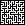

# Maze Algorithms Final Project
The actual assignment was to study the difference between multiple different algorithms for a given problem, but I found it hard to explain how exactly the algorithms exactly worked, so I integrated a system to produce the choice history of which pixels were joined with each other. Unfortunately, when increasing the size of the graphics for the README, they became blurred. The sanitization that GitHub does prevents the css from working. If you would like to see how I intended this to look, right click the gif, click `inspect`, and in the block that says `style=...`, put `image-rendering: pixelated`. If you do this, the image will un-blur. Regardless, here is the result:
### Kruskal's Algorithm on a 25x25 pixel grid

### And an A-Star search algorithm to solve it!

### Prim's Algorithm on a 25x25 pixel grid

### And a Recursive Backtracking algorithm to solve this one!

### Just so you don't think I didn't try, this is a 1001x1001 pixel grid that was solved with an A-Star algorithm. This may or may not have used 12Gb of ram to solve. The solution path starts in the upper right corner and transitions slowly from red, through purple, to blue in the lower left corner.

